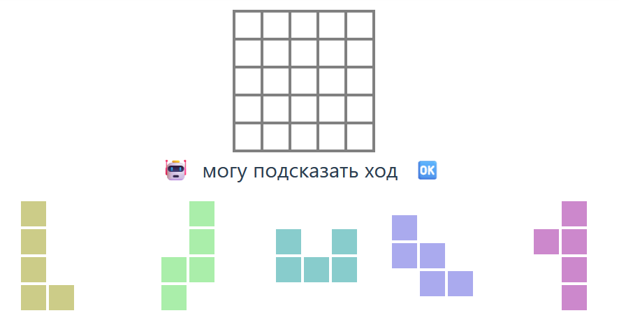

# Игра полимино

В этой игре нужно укладывать фигуры в прямоугольник заданной формы. На демонстрационном сайте реализована игра пентамино с 5, 8 и 12 фигурами из числа фигур пентамино.

На экране игры нарисовано поле с клетками, которые нужно заполнить. 

Под полем находится область робота-решателя головоломок. Робот делает запрос к серверу с текущей ситуацией на доске и получает возможный следующий ход. Если ход существует, нажатием на кнопку 🆗 можно установить фигуру на доску. Нажатием на кнопку 🤖 можно отключить запрос подсказок.

В нижней части экрана находится касса фигур. При наведении курсора на фигуру слева, справа и снизу от фигуры появляются кнопки вращения и зеркального переворота. Если фигура симметрична относительно какого-либо из преобразований, соответствующие кнопки не появятся.

Фигуры устанавливаются на доску перетаскиванием с помощью курсора, а удаляются с доски нажатием на установленнную фигуру.

## О составе проекта

Проект состоит из написанных на [Python](https://www.python.org/) [решателя](backend/engine/) головоломок и [сервера](backend/app/) на [FastAPI](https://fastapi.tiangolo.com/), а также [клиентской](./frontend/) части приложения, выполненной с использованием [Vue 3](https://vuejs.org/).

# Запуск проекта

Указания по развертыванию проекта на удаленном сервере приведены в папке [infra](./infra).
